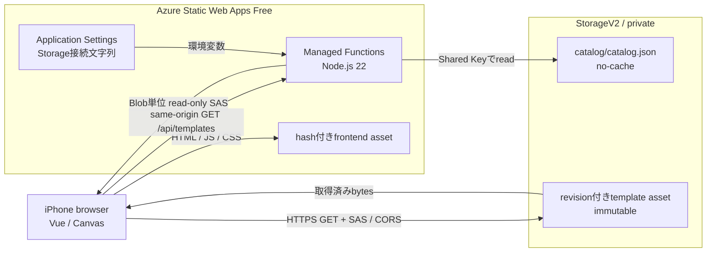

# Azureテンプレート配信F/S構成

- 対象: `validate-azure-template-delivery`
- 更新日: 2026-09-21
- 状態: F/S実装・実機検証済み

browserはtemplate一覧だけをSWAのsame-origin APIから取得し、画像bytesはBlob単位・読み取り専用・HTTPS限定・60分のSASを使ってBlobから直接取得する。APIは画像をproxyしない。Storage CORSは動的なPRプレビューに対応するためoriginを`*`とするが、許可methodは`GET`、`HEAD`、`OPTIONS`だけであり、private containerとSASが認可を担う。

SWA managed FunctionsはManaged Identityを使用できないため、F/SではStorage接続文字列をApplication Settingsへ置き、Service SASを署名する。接続文字列はfrontend、Bicep、repository、通常logへ含めない。SASもdiagnosticではqueryを除去し、永続化しない。

frontend、API、`release.json`はapp versionとデプロイ固有build IDを共有する。制作Start前に三者を照合し、選択templateの線画と全maskを取得・decodeしてsessionへ固定する。Start後はAPI、release、Blobを再取得せず、Canvasが取得済みbytesから完成PNGを生成するため、同じPR URLが次のbuildへ更新されても旧tabを継続できる設計である。

2026-09-21のPRプレビューで、iPhone 15（iOS 26）のSafari・Chromeを使ってBuild AからBuild Bへの更新をまたぐ旧tabのPNG生成、長押し保存、共有を確認した。Start後のAPI、release、Blob、JavaScript、CSSの追加requestはいずれも0件で、SAS期限経過後も取得済みbytesだけで完遂できた。未開始の旧build tabではStart前にbuild不一致を検出して再読み込みを案内し、Start済みsessionは強制再読み込みしなかった。

## cache境界

| resource | 方針 |
| --- | --- |
| `index.html` | `no-cache` |
| `release.json` | `no-store` |
| `GET /api/templates` | `no-store` |
| hash付きJavaScript・CSS | `public, max-age=31536000, immutable` |
| revision付きtemplate asset | `public, max-age=31536000, immutable` |
| `catalog/catalog.json` | server側で毎回再検証し、Blob metadataは`no-cache` |

JavaScriptとCSSのcontent hashは維持する。完成PNGはDOM screenshotやserver CSSへ依存せず、制作開始時までに読み込んだcodeとassetからCanvasで生成する。

## 秘密値と運用境界

| 対象 | 保管場所 | frontendへの露出 |
| --- | --- | --- |
| Storage接続文字列 | SWA Application Settings / gitignore済みlocal settings | 不可 |
| account key | 接続文字列内だけ | 不可 |
| Service SAS | API responseからStart時のmemoryだけ | URLとして必要。log・永続化は不可 |
| build ID | frontend、API、`release.json` | 可 |
| catalog revision | Blob catalog、API response | 可 |

## 復旧設定

- Blobとcontainerのsoft delete: 14日
- Blob versioning: 有効
- asset path: `templates/<template-id>/<revision>/...`。既存pathは上書きしない
- catalog更新: 新revisionのassetを全件配置・検査した後で最後に行う
- 公開停止: catalogを先に変更し、旧assetは24時間の削除猶予後に削除する

Android Chromeは端末確保後の回帰確認とし、今回のF/S合否には含めていない。

検証結果と本番への採否は[`docs/spikes/azure-template-delivery.md`](../spikes/azure-template-delivery.md)へ記録する。
