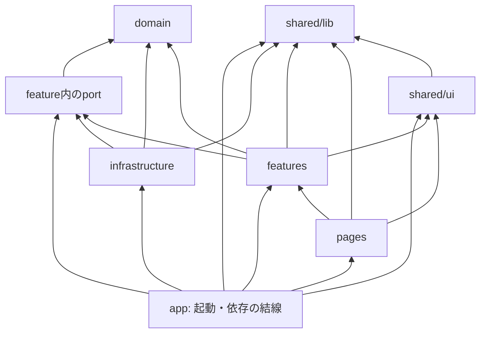

# フロントエンドアプリケーションアーキテクチャ

> ステータス: 実装済み
>
> 最終更新日: 2026-09-17
>
> 対応change: `establish-frontend-foundation`

## 目的

この文書は、Moment PaletteのVueフロントエンドについて、実装時に参照するソース構成、各領域の責務、importの依存方向を定める。判断理由と比較した代替案は、対応するOpenSpec changeの`design.md`を正本とする。

初期段階では構造を先に作り込みすぎず、実際にコードが必要になった時点でディレクトリと境界を追加する。

## リポジトリ内の配置

```text
moment-palette/
├── src/                 # Vueフロントエンド
├── public/              # ビルド時にそのまま配信する静的ファイル
├── api/                 # 将来追加するSWAマネージドAPI
├── docs/
└── openspec/
```

フロントエンドはリポジトリ直下の`src/`へ置く。将来マネージドAPIを追加する場合は同階層に`api/`を作るが、利用するchangeまでは作成しない。

## `src/`の構成

```text
src/
├── main.ts              # Vueエントリポイント、依存の組み立て
├── app/                 # ルートコンポーネント、ルーティング、i18n、設定
├── pages/               # 画面全体のレイアウトと画面遷移
├── features/            # ユーザー操作単位のUI、状態、ユースケース、port
├── domain/              # 中心概念の型と純粋な規則
├── infrastructure/      # HTTP、ブラウザAPI、永続化など外部入出力の実装
└── shared/
    ├── ui/              # 複数画面・featureで再利用する汎用Vue部品
    └── lib/             # Vueや外部入出力に依存しない汎用関数
```

この一覧は利用可能な責務を示すものであり、最初からすべてのディレクトリを作ることを意味しない。次の基準で、必要になった時点で追加する。

- 画面を表す`.vue`ファイルは`pages/`へ置く。
- 独立したユーザー操作として育ったコードは`features/`へ置く。
- `Artwork`や`Template`などの中心概念と純粋な更新規則は`domain/`へ置く。
- HTTP、カメラ、Cookieなど、アプリ外部との入出力を行うTypeScript実装は`infrastructure/`へ置く。
- 二つ以上の画面またはfeatureで実際に再利用するVue部品だけを`shared/ui/`へ移す。
- 複数の領域で実際に再利用する副作用のない関数だけを`shared/lib/`へ移す。
- クライアント設定は`app/config/`、型は原則として所有するdomain、feature、portの近くへ置く。
- 用途が明確になる前に`utils/`、`shared/config/`、`shared/types/`を作らない。

このchange完了時点の実装は次のとおりである。

```text
src/
├── main.ts
├── env.d.ts
├── app/
│   ├── App.vue
│   ├── router.ts
│   ├── styles.css
│   └── i18n/
│       ├── index.ts
│       ├── messages/
│       │   ├── en.ts
│       │   └── ja.ts
│       ├── selectInitialLocale.ts
│       └── selectInitialLocale.test.ts
└── pages/
    └── TitlePage.vue
```

現時点では利用するユースケースがないため、`features/`、`domain/`、`infrastructure/`、`shared/`は作成していない。

## importの依存方向

次の矢印は、呼び出し順ではなくimportによるコンパイル時依存を表す。



依存規則は次のとおりとする。

- `domain/`は他のアプリケーションディレクトリへ依存しない。Vue、HTTP、ブラウザAPIも参照しない。
- domain内だけで必要な小さな補助関数はdomain内へ置く。複数領域で再利用される事実が生じるまで`shared/lib/`へ移さない。
- `shared/lib/`はVue、domain、HTTP、ブラウザAPIへ依存しない。
- `shared/ui/`はVueと`shared/lib/`へ依存できるが、domain固有の知識を持たない。
- `pages/`はfeatureを組み合わせるが、`infrastructure/`へ直接依存しない。
- feature同士は直接importしない。画面上の組み合わせは`pages/`、セッション全体の状態や依存の組み立ては`app/`が担う。
- `app/`とVueエントリポイントの`src/main.ts`はcomposition rootとして、具体的なinfrastructure実装と、featureが公開する状態factoryやportのInjectionKeyを参照できる。

初期段階では依存規則のためだけの追加ライブラリは導入しない。規則違反が増え、人手の確認では維持できなくなった時点で自動検査を検討する。

## 外部入出力の境界

カメラ、Canvas、Web Share、テンプレート取得、Cookieなどの外部入出力が必要になった場合は、次の順序で境界を追加する。

1. 利用するfeature内に、そのユースケースが必要とする最小限のportを定義する。
2. `infrastructure/`にportの具体的な実装を置く。
3. `app/`で具体実装を生成し、provide/injectまたは明示的なfactoryでfeatureへ渡す。
4. featureの単体テストではportを差し替え、ブラウザ非依存の振る舞いを検証する。

HTTPレスポンスやSAS URLなど、外部サービス固有の形式をdomainや画面へ直接漏らさない。利用するユースケースが存在しない段階では、将来用のport、mock、開発用実装、空ディレクトリを作らない。

## 状態管理

- feature内の状態は、まずVueの`ref`または`reactive`を使うcomposableで管理する。
- 複数画面にまたがる制作セッションは、必要になった時点で`app/`が生成してprovideする。
- domainはリアクティブ状態を持たず、イミュータブルなデータと純粋関数を基本とする。
- Piniaは現時点では導入せず、複数feature間の状態共有が複雑になった時点で再評価する。

## アプリケーションシェル

- ルーティングにはVue RouterのHTML5 historyを使用し、`import.meta.env.BASE_URL`を基準パスとする。
- `/`でタイトル画面を表示し、未知のアプリ内URLはタイトル画面へ戻す。
- 日本語と英語のメッセージを`app/i18n/`で管理し、初期言語はブラウザの優先言語が`ja`または`ja-*`なら日本語、それ以外は英語とする。
- タイトル画面から日本語と英語を切り替えられるようにする。
- 表示言語に合わせて`html`要素の`lang`を更新する。
- 縦向きのモバイル画面を基準とし、動的ビューポートとセーフエリアを考慮する。
- クライアント設定は`app/config/`を入口とし、公開可能な`VITE_`接頭辞の値だけを参照する。
- Azure Static Web Appsのnavigation fallbackと実機確認は、後続のプレビュー環境changeで行う。

## 開発品質

- TypeScriptのstrict設定と`vue-tsc --noEmit`で、TypeScriptとVue SFCを型検査する。
- Vitestでブラウザ非依存ロジックを単体テストする。
- ESLintは品質規則、Prettierは整形を担当する。
- `typecheck`、`test:run`、`lint`、`format:check`、`build`は非対話で実行できるようにする。
- Vue部品のテストが必要になるまでは、Vue Test UtilsとDOMテスト環境を追加しない。

## 更新ルール

ソース構成、依存方向、外部入出力の結線方法を変更するOpenSpec changeでは、この文書も同じchange内で更新する。実装後は、文書に記載した構成と実際のimportが一致していることを確認する。
