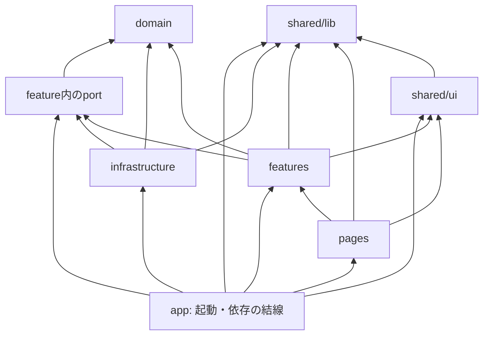
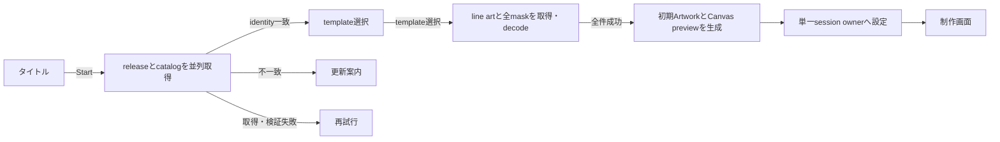
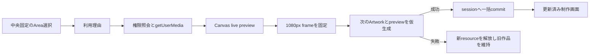

# フロントエンドアプリケーションアーキテクチャ

> ステータス: 制作session・camera fill実装済み
>
> 最終更新日: 2026-09-22
>
> 対応change: `establish-frontend-foundation`、フェーズ3の各F/S、`establish-creation-session`、`implement-camera-fill`

## 目的

この文書は、Moment PaletteのVueフロントエンドについて、実装時に参照するソース構成、各領域の責務、importの依存方向を定める。判断理由と比較した代替案は、対応するOpenSpec changeの`design.md`を正本とする。

初期段階では構造を先に作り込みすぎず、実際にコードが必要になった時点でディレクトリと境界を追加する。

## リポジトリ内の配置

```text
moment-palette/
├── src/                 # Vueフロントエンド
├── public/              # ビルド時にそのまま配信する静的ファイル
├── api/                 # SWAマネージドAPI
├── docs/
└── openspec/
```

フロントエンドはリポジトリ直下の`src/`へ置く。マネージドAPIは同階層の`api/`へ置き、frontendと別のTypeScript設定、package、testで管理する。

## `src/`の構成

```text
src/
├── main.ts              # Vueエントリポイント、依存の組み立て
├── app/                 # ルートコンポーネント、ルーティング、i18n、設定
├── pages/               # 画面全体のレイアウトと画面遷移
├── features/            # ユーザー操作単位のUI、状態、ユースケース、port
├── domain/              # 中心概念の型と純粋な規則
├── infrastructure/      # HTTP、ブラウザAPI、永続化など外部入出力の実装
└── shared/
    ├── ui/              # 複数画面・featureで再利用する汎用Vue部品
    └── lib/             # Vueや外部入出力に依存しない汎用関数
```

この一覧は利用可能な責務を示すものであり、最初からすべてのディレクトリを作ることを意味しない。次の基準で、必要になった時点で追加する。

- 画面を表す`.vue`ファイルは`pages/`へ置く。
- 独立したユーザー操作として育ったコードは`features/`へ置く。
- `Artwork`や`Template`などの中心概念と純粋な更新規則は`domain/`へ置く。
- HTTP、カメラ、Cookieなど、アプリ外部との入出力を行うTypeScript実装は`infrastructure/`へ置く。
- 二つ以上の画面またはfeatureで実際に再利用するVue部品だけを`shared/ui/`へ移す。
- 複数の領域で実際に再利用する副作用のない関数だけを`shared/lib/`へ移す。
- クライアント設定は`app/config/`、型は原則として所有するdomain、feature、portの近くへ置く。
- 用途が明確になる前に`utils/`、`shared/config/`、`shared/types/`を作らない。

基盤change完了時点の実装は次のとおりであった。

```text
src/
├── main.ts
├── env.d.ts
├── app/
│   ├── App.vue
│   ├── router.ts
│   ├── styles.css
│   └── i18n/
│       ├── index.ts
│       ├── messages/
│       │   ├── en.ts
│       │   └── ja.ts
│       ├── selectInitialLocale.ts
│       └── selectInitialLocale.test.ts
└── pages/
    └── TitlePage.vue
```

フェーズ3では`features/`、`infrastructure/`、`shared/lib/`へF/Sコードを追加した。これらは境界と処理方式を検証するための実装であり、そのまま製品構成の正本にはしない。本実装changeでは各F/S記録の「コードの扱い」に従い、製品責務へ昇格・再実装したmoduleだけを残し、F/S専用route、page、診断UI、固定assetを削除する。

`establish-creation-session`では、製品導線として次を追加した。

```text
src/
├── app/
│   ├── createCreationSessionAppService.ts
│   └── creationSessionAppService.ts
├── domain/
│   └── template.ts
├── features/
│   ├── creation-session/
│   └── template-selection/
├── infrastructure/
│   ├── creation-session/
│   └── template-selection/
├── pages/
│   ├── TemplateSelectionPage.vue
│   └── CreationPage.vue
└── shared/ui/
    └── LanguageSwitcher.vue
```

pageは`CreationSessionFacade`のview stateとcommandだけを参照する。`app/`のserviceが二つのfeature use caseを組み合わせ、具体的なbrowser adapterを注入するため、UIのtemplateとstyleを変更してもdomain、HTTP、Canvasへ波及しない。

`implement-camera-fill`では、`features/camera-fill/`へArea selector、camera状態機械、camera・permission・compositor portを追加し、`infrastructure/camera/`と`infrastructure/camera-fill/`へbrowser実装を置いた。camera componentはcreation-session featureを直接importせず、`pages/CreationPage.vue`がfacadeのview stateとcommandをpropsとして結線する。

## importの依存方向

次の矢印は、呼び出し順ではなくimportによるコンパイル時依存を表す。



依存規則は次のとおりとする。

- `domain/`は他のアプリケーションディレクトリへ依存しない。Vue、HTTP、ブラウザAPIも参照しない。
- domain内だけで必要な小さな補助関数はdomain内へ置く。複数領域で再利用される事実が生じるまで`shared/lib/`へ移さない。
- `shared/lib/`はVue、domain、HTTP、ブラウザAPIへ依存しない。
- `shared/ui/`はVueと`shared/lib/`へ依存できるが、domain固有の知識を持たない。
- `pages/`はfeatureを組み合わせるが、`infrastructure/`へ直接依存しない。
- feature同士は直接importしない。画面上の組み合わせは`pages/`、セッション全体の状態や依存の組み立ては`app/`が担う。
- `app/`とVueエントリポイントの`src/main.ts`はcomposition rootとして、具体的なinfrastructure実装と、featureが公開する状態factoryやportのInjectionKeyを参照できる。

初期段階では依存規則のためだけの追加ライブラリは導入しない。規則違反が増え、人手の確認では維持できなくなった時点で自動検査を検討する。

## 外部入出力の境界

カメラ、Canvas、Web Share、テンプレート取得、Cookieなどの外部入出力が必要になった場合は、次の順序で境界を追加する。

1. 利用するfeature内に、そのユースケースが必要とする最小限のportを定義する。
2. `infrastructure/`にportの具体的な実装を置く。
3. `app/`で具体実装を生成し、provide/injectまたは明示的なfactoryでfeatureへ渡す。
4. featureの単体テストではportを差し替え、ブラウザ非依存の振る舞いを検証する。

HTTPレスポンスやSAS URLなど、外部サービス固有の形式をdomainや画面へ直接漏らさない。利用するユースケースが存在しない段階では、将来用のport、mock、開発用実装、空ディレクトリを作らない。

## 状態管理

- feature内の状態は、まずVueの`ref`または`reactive`を使うcomposableで管理する。
- 複数画面にまたがる制作セッションは、`app/`がfactoryから一つ生成してprovideする。画面や個別featureが独自の作品copyを持たない。
- domainはリアクティブ状態を持たず、イミュータブルなデータと純粋関数を基本とする。
- 初期リリースではPiniaなどの専用状態管理ライブラリを導入しない。制作状態のownerが一つで、session APIを通じた明示的な更新と単体テストが可能なためである。

状態とresourceのownerは次のように分ける。

| owner | 保持するもの |
| --- | --- |
| `app/`の開始処理 | build identity、catalog snapshot、開始中・更新必要・失敗の状態 |
| 制作session | template IDとrevision、decode済みline art・mask、順序付き作品状態、Area単位の撮影frame、現在の作品preview。Area上書き、session置換・終了で不要resourceを解放する |
| カメラfeature | live stream、現在のpan・zoom・比較比率、権限・取得状態。撮影、cancel、background移行、離脱でstreamを停止する |
| 写真feature | picker結果、decode・正規化中のresource、pan・zoom・比較比率。反映後は正規化済みframeをsessionへ渡す |
| 完成feature | sessionの作品versionに対応するPNG Blobとobject URL。作品変更・離脱で破棄する |

専用状態管理ライブラリは、独立した複数sessionを同時に扱う、session外の複数featureが同じ状態を個別に更新する、またはprovideされた明示的APIでは循環依存や更新追跡を維持できない、のいずれかが実際に発生した場合に再評価する。

## 制作session開始導線



- `creation-session`はbuild identity、Start状態、release port、単一session ownerを持つ。
- `template-selection`は製品catalog schema、catalog port、asset loader port、Canvas preview port、template準備規則を持つ。
- `app`が両featureを組み合わせ、tabにつき一つのsnapshotと制作sessionを保持する。
- snapshotなしの`/templates`とsessionなしの`/create`はrouter guardでタイトルへ戻す。
- sessionの置換、タイトルへの復帰、app unmount、`pagehide`は同じownerをclearし、resourceを冪等に解放する。
- 制作画面へ進んだ後はrelease、catalog、asset portを再度呼ばず、取得済みresourceだけを使う。

フェーズ5では製品導線へ開発用catalog adapterを結線する。このadapterも製品schema version 1のvalidatorを通る。フェーズ6ではcomposition rootのcatalog adapterだけを`GET /api/templates`実装へ差し替え、feature、domain、pageを維持する。

F/Sからはbuild identity判定、browser release adapter、decode処理、session ownerを製品moduleへ昇格または共通化した。現行API response、診断UI、固定色compositorは製品契約と異なるためF/S routeに残し、フェーズ6のAPI移行まで保持する。

## Camera fill導線とresource所有



- `ArtworkArea.fill`は`initial`または`camera`という作品上の意味だけを持ち、Canvas resourceをdomainへ格納しない。
- 撮影frameはArea IDをkeyとするsession resourceとして保持する。同じAreaの撮り直しでは新preview生成後に旧frameと旧previewを解放する。
- live previewは全体camera映像のsource planeと、現在作品のartwork planeを比較比率で重ね、line artを最後に描く。選択Areaは両planeへ同じlive映像を描くため中間比率でも薄くならない。
- pan・pinchは`shared/lib/mediaTransform.ts`と`pointerGesture.ts`の純粋ロジックを使い、編集Canvasだけへ`touch-action: none`を適用する。
- camera F/Sの専用route、診断UI、固定asset loader、固定templateは製品導線への移行後に削除した。開発用template画像は`public/templates/<template-id>/<revision>/`へ移し、製品schemaのcatalog adapterから参照する。

## UI component方針

初期リリースではUI component libraryを導入しない。主要UIはCanvasを含む作品領域、中央固定のエリア選択、作品比較slider、撮影、写真調整など製品固有であり、汎用libraryの複雑なcomponentをほとんど必要としないためである。

- native HTMLのbutton、input、dialog相当の意味とkeyboard・screen reader向け属性を優先する。
- 二つ以上の画面またはfeatureで実際に同じ振る舞いを使う場合だけ`shared/ui/`へ抽出する。
- 見た目の共通値はCSS custom propertiesとして`app/styles.css`から始め、component library固有tokenへ依存しない。
- camera、photo、Canvasのgesture領域は汎用carouselやgesture componentへ合わせず、F/Sで成立したPointer Eventsと局所的な`touch-action`制御を使用する。

UI component libraryは、accessibilityを満たすdialog、popover、listboxなどの複雑な部品を三種類以上独自実装する必要が生じた場合、または同じinteractionの重複が実装とtestで維持できなくなった場合に再評価する。

## アプリケーションシェル

- ルーティングにはVue RouterのHTML5 historyを使用し、`import.meta.env.BASE_URL`を基準パスとする。
- `/`でタイトル画面を表示し、未知のアプリ内URLはタイトル画面へ戻す。
- `/templates`でStart時のsnapshotからtemplateを選択し、`/create`で初期作品を表示する。必要なtab内状態がなければタイトルへ戻す。
- 日本語と英語のメッセージを`app/i18n/`で管理し、初期言語はブラウザの優先言語が`ja`または`ja-*`なら日本語、それ以外は英語とする。
- タイトル画面から日本語と英語を切り替えられるようにする。
- 表示言語に合わせて`html`要素の`lang`を更新する。
- 縦向きのモバイル画面を基準とし、動的ビューポートとセーフエリアを考慮する。
- クライアント設定は`app/config/`を入口とし、公開可能な`VITE_`接頭辞の値だけを参照する。
- Azure Static Web Appsのnavigation fallbackと実機確認は、後続のプレビュー環境changeで行う。

## 開発品質

- TypeScriptのstrict設定と`vue-tsc --noEmit`で、TypeScriptとVue SFCを型検査する。
- Vitestでブラウザ非依存ロジックを単体テストする。
- ESLintは品質規則、Prettierは整形を担当する。
- `typecheck`、`test:run`、`lint`、`format:check`、`build`は非対話で実行できるようにする。
- Vue部品のテストが必要になるまでは、Vue Test UtilsとDOMテスト環境を追加しない。

## 更新ルール

ソース構成、依存方向、外部入出力の結線方法を変更するOpenSpec changeでは、この文書も同じchange内で更新する。実装後は、文書に記載した構成と実際のimportが一致していることを確認する。
