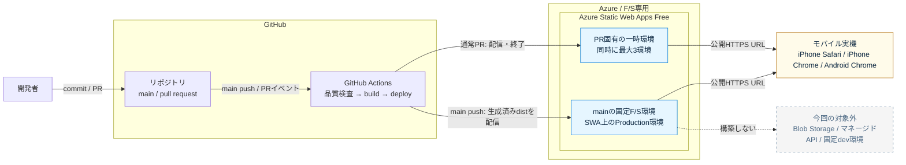

# F/S用SWAデプロイ仕様の確認記録

この文書は、`establish-preview-deployment`で採用した外部仕様とGitHub Actionを記録する。確認日は2026-09-18である。Portal生成テンプレートは使用せず、次の公式ドキュメントおよび正規リポジトリを確認した。

## 暫定構成図

- 対象環境: 技術F/S専用
- 更新日: 2026-09-18
- 構成状態: **提案**

SWA上のProduction環境は、実サービス本番ではなくマージ済み状態を配信するF/S用固定環境である。外部forkとDependabot PRは品質検査だけを行い、SWAへはデプロイしない。

図はGitHubがMarkdown内でネイティブ描画するMermaidを正本兼表示形式とする。Microsoftの[Azure Architecture Icons](https://learn.microsoft.com/azure/architecture/icons/)と[Architecture design diagrams](https://learn.microsoft.com/azure/well-architected/architect-role/design-diagrams)の方針を確認し、正式なAzureサービス名、方向付きでラベルのある経路、対象範囲、更新日、状態を明示した。今回の小さな提案図では、追加レンダラーや未登録のアイコンライブラリを必要としない再現性を優先して公式SVGを埋め込まない。より詳細な実サービス構成図を作る際は、最新の公式アイコンを使う。

## ローカルSWAエミュレーター

2026-09-18時点の公式[`@azure/static-web-apps-cli`](https://www.npmjs.com/package/@azure/static-web-apps-cli) `2.0.10`を開発依存へ固定した。[SWA CLIの公式リファレンス](https://learn.microsoft.com/azure/static-web-apps/static-web-apps-cli)と[runtime configの探索規則](https://azure.github.io/static-web-apps-cli/docs/use/config/)に基づき、`swa start dist --swa-config-location dist`でbuild成果物とその`staticwebapp.config.json`を明示的に指定する。

SWA CLIはルーティング設定のローカル確認だけに使用し、Azureへのログインやデプロイには使用しない。Vite PreviewはSWA固有設定を解釈しないため、この確認の代替にはしない。

## Azure Static Web Apps Actionの入力

[Azure Static Web Appsのbuild設定](https://learn.microsoft.com/azure/static-web-apps/build-configuration)、[構成ファイルの配置要件](https://learn.microsoft.com/azure/static-web-apps/configuration)、[`Azure/static-web-apps-deploy`のAction定義](https://github.com/Azure/static-web-apps-deploy/blob/1a947af9992250f3bc2e68ad0754c0b0c11566c9/action.yml)に基づき、次のように設定する。

| 用途 | 設定 |
|---|---|
| 生成済み成果物の配信 | `action: upload` |
| PR一時環境の終了 | `action: close` |
| F/S用固定環境のブランチ | workflowのpush triggerを`main`だけに限定 |
| Action内部のbuild | `skip_app_build: true` |
| 配信する生成済み成果物 | `app_location: dist` |
| `skip_app_build`時の出力先 | `output_location: ''` |
| API | `api_location`を指定しない |

`skip_app_build: true`の場合、`app_location`はソースではなく配信対象のbuild出力を指し、`output_location`は空にする。`staticwebapp.config.json`はbuild出力のルートに置く。

実行ログで公式Actionの`action.yml`が`production_branch`を入力として公開していないことを確認したため、この無効な入力は指定しない。固定環境への配信元はworkflowのpush triggerを`main`だけに限定して保証し、`main`向けPRはGitHubのpull requestイベント情報から一時環境へ配信する。

## 固定したGitHub Action

| Action | リリース | 完全長commit SHA |
|---|---|---|
| [`actions/checkout`](https://github.com/actions/checkout/releases/tag/v7.0.1) | `v7.0.1` | `3d3c42e5aac5ba805825da76410c181273ba90b1` |
| [`actions/setup-node`](https://github.com/actions/setup-node/releases/tag/v7.0.0) | `v7.0.0` | `820762786026740c76f36085b0efc47a31fe5020` |
| [`pnpm/setup`](https://github.com/pnpm/setup/releases/tag/v2.1.0) | `v2.1.0` | `703c52620218391530e48b9e8870d5c0082e1b9b` |
| [`Azure/static-web-apps-deploy`](https://github.com/Azure/static-web-apps-deploy/releases/tag/v1) | `v1` | `1a947af9992250f3bc2e68ad0754c0b0c11566c9` |

workflow内では完全長SHAと同じ行にリリース名をコメントで残す。`.github/dependabot.yml`がGitHub Actionsを週次監視するが、更新PRは自動mergeしない。

`Azure/static-web-apps-deploy`の固定SHAはActionリポジトリの定義を固定する。ただし、[同ActionのDockerfile](https://github.com/Azure/static-web-apps-deploy/blob/1a947af9992250f3bc2e68ad0754c0b0c11566c9/Dockerfile)が参照する`staticappsclient:stable`やSWAサービス自体までは固定しないため、更新後は実際のデプロイでも互換性を確認する。

## Dependabot PRの扱い

GitHubではDependabotが作成したPRのworkflowをfork由来と同等に扱い、Actionsのrepository secretを渡さない。したがってDependabot PRでは通常の品質検査だけを実行し、SWAへの自動プレビューは行わない。Action更新をレビューして通常の作業ブランチへ取り込んだ確認PRで、実デプロイを検証する。`pull_request_target`の利用やDependabot専用secretへのトークン複製は行わない。
