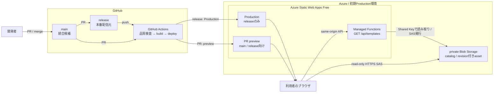

# 初期Productionテンプレート配信構成

> 状態: 実装・実環境確認済み
>
> 最終更新日: 2026-09-24

既存のSWAとprivate Blob Storageは、名称に残る`fs`を歴史的識別子として維持したまま、初期Production環境へ昇格した。新規resourceの作成や既存SWAの再作成は行わない。

Productionは`TEMPLATE_CATALOG_FILE=catalog.json`を使う。PR previewは同じStorageとrevision付きassetを共有し、必要時だけApplication Settingsで別の安全なcatalogファイル名へ切り替える。`TEMPLATE_CATALOG_BLOB`は廃止済みで、製品APIは参照しない。

開始時にfrontend、`release.json`、API responseのapp versionとbuild IDを照合する。選択templateの全assetをdecodeした後は、API、Blob、JavaScript、CSSを再取得せず、配信更新および60分SAS期限後も完成・保存・共有を継続する。

## 運用

- assetは`templates/<template-id>/<revision>/`へ先に配置し、Content-Typeと`public, max-age=31536000, immutable`を確認する。
- catalogは最後に`no-cache`で更新する。公開停止時はcatalogを先に変更し、参照されなくなったassetを24時間以上残す。
- 配信障害は`release`へのrevert PRで復旧する。catalog障害は直前revisionへ戻し、誤削除・上書きは14日のsoft deleteまたはBlob versionから復元する。
- secret、Storage接続文字列、account key、SAS queryはrepository、文書、通常ログへ残さない。
