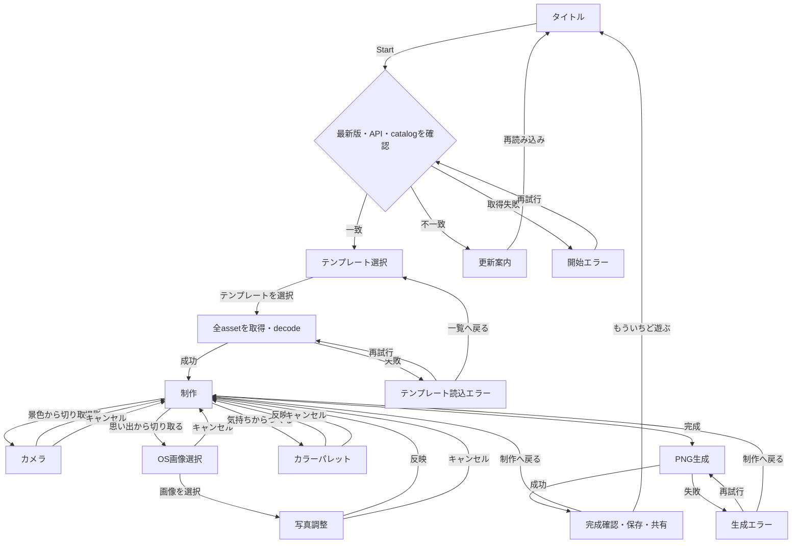

# 画面遷移と制作セッション

> ステータス: F/S結果反映済み
>
> 最終更新日: 2026-09-21

## 目的

この文書は、初期リリースの画面遷移と、配信中の更新をまたいでも制作を完遂するためのセッション境界を定める。各画面の見た目はFigma、詳細な状態と表示内容は[`ui-states.md`](ui-states.md)、プロダクト要求は[`docs/vision.md`](../vision.md)を参照する。

## 主要フロー

未着色エリアが残っていても、制作画面から完成確認へ進める。テンプレート選択画面へ戻る操作、ブラウザの戻る操作、別画面へ移る操作で制作内容が失われる場合は、破棄確認を表示する。

## セッション境界

Startは新しい制作セッションを始める意思を確定する操作とする。実際のresource所有権は、次の二段階で確立する。

1. Start時に、読み込み済みfrontend、`release.json`、`GET /api/templates`のapp versionとbuild IDを照合し、公開中テンプレートのcatalog snapshotを取得する。不一致の場合は作品状態を作らず、更新案内を表示する。
2. テンプレート選択後に、そのrevisionの線画と全maskを取得・decodeする。すべて成功した時点で作品状態を生成し、制作画面へ進む。

制作画面へ進んだ後は、catalog、API、release情報、Blob assetを再取得しない。選択したtemplateのdecode済みresource、撮影frame、正規化済み写真、作品状態、完成PNGは、そのtabの制作セッションが所有する。

テンプレート一覧を長時間開いた結果としてSASが期限切れになった場合を含め、assetの取得・decodeに失敗したときは部分的なresourceを解放する。再試行で同じsnapshotを利用できない場合はStart処理からやり直し、最新版と新しいcatalogを取得する。

## 制作状態の破棄

- 完成確認から制作へ戻るだけでは、作品状態を破棄しない。作品を変更した時点で以前の完成PNGとobject URLを破棄する。
- 「もういちど遊ぶ」は現在のresourceをすべて解放し、タイトルへ戻る。次のStartで最新版を再確認する。
- route離脱、tab終了、再読み込みでは、カメラtrack、object URL、decode済み画像への参照を解放する。
- ページがOSに破棄された後の復元や、tabを閉じた後の再開は初期リリースの対象外とする。

## 全画面に重なる状態

- 端末が横向きになった場合は、現在の画面と制作状態を保持したまま、縦向きへ戻す案内を全面表示する。
- 制作開始後に新しいreleaseを検出しても強制再読み込みしない。更新案内は次のStart時に表示する。
- 想定外エラーでは写真、完成画像、SAS query、Storage接続情報を画面や外部logへ出力しない。
