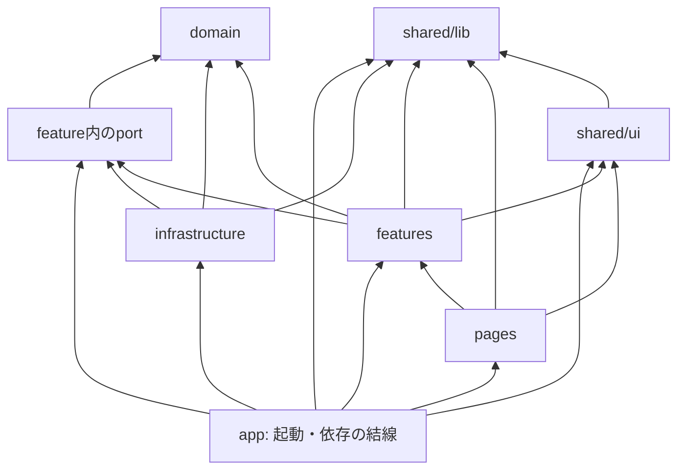

## Context

Moment Palette は、モバイルブラウザ上でカメラ、端末内の写真、単色を組み合わせて作品を作るVueアプリケーションである。現時点ではアプリケーションコードがなく、後続の主要機能および技術F/Sを安全に追加するためのソース構成、外部依存の境界、開発ツールを確立する必要がある。

初期の正式対応環境はスマートフォン向けのiPhone Safari、iPhone Chrome、Android Chromeである。撮影画像や作品状態はサーバーへ保存せず、ブラウザ内で扱う。将来はAzure Static Web AppsのマネージドAPIを同一リポジトリへ追加する可能性があるが、API実装とAzureリソースの構築はこのchangeの対象外とする。

本設計は、要求と画面設計の基準版、ならびにproposalでの対話を踏まえた決定である。

## Goals / Non-Goals

**Goals:**

- Vue 3、Vite、TypeScriptによるモバイル向けフロントエンドの土台を用意する。
- 画面、ユーザー操作、作品・テンプレートのドメイン、ブラウザAPI・通信の実装を分離し、後続機能を追加しやすくする。
- カメラ、Canvas、Web Share、テンプレート取得を後続changeでテスト可能かつ差し替え可能に追加できる依存規則を定める。
- 日本語・英語を切り替えられるタイトル画面、ルーティング、モバイル向けの基本レイアウトを備えた最小限のアプリケーションシェルを用意する。
- 単体テスト、型検査、lint、formatをローカルで実行でき、後続のCIからも同じ非対話スクリプトを呼び出せるようにする。
- 合意した構成と依存ルールを実装開始前に `docs/architecture/` へ記録する。

**Non-Goals:**

- カメラ、Canvas合成、Web Share、写真選択、完成PNG生成の実装。
- Azure Static Web Apps、マネージドAPI、Blob Storage、SAS URLの構築と接続。
- カメラ、Canvas、Web Share、テンプレート取得の未使用port、mock、開発用実装の先行追加。
- UIコンポーネントライブラリ、グローバル状態管理ライブラリ、E2Eテスト基盤の導入。
- 永続化、Cookie、Local Storageの具体的な利用。必要になった時点でブラウザアダプターとして追加する。
- GitHub Actions、Azure向けSPAフォールバック、デプロイ設定の追加。
- 横向き時の全面案内など、制作画面を前提とする端末状態UIの実装。

## Decisions

### 1. Node.js 24 LTS、Vue 3、Vite、TypeScriptとpnpmを採用する

開発ランタイムにはNode.js 24 LTS系列を採用し、リポジトリ内のバージョンファイルと`package.json`の`engines`へ対応系列を記録する。フロントエンドはVue 3とViteを使い、TypeScriptのstrict設定を有効にする。Vue SFCを含む型検査には`vue-tsc --noEmit`を使用する。

パッケージマネージャーにはpnpmを採用し、`packageManager`へ正確なバージョンを記録する。Corepackは利用可能な環境での導入手段の一つとし、Node.jsへの同梱だけには依存しない。READMEにはCorepackを利用しない場合も含め、固定されたpnpmを準備する手順を記載する。pnpmはnpmと同じ`package.json`の依存定義を利用でき、依存の厳密性、ディスク使用量、将来的なworkspace運用に利点がある。

`npm`は追加ツールの導入が不要な代替案であり、Yarnも利用可能である。しかし本リポジトリでは将来的にフロントエンドと`api/`を同居させる可能性があり、PnPなど追加のモジュール解決方針を検討する必要があるYarnより、pnpmを標準とする。

### 2. リポジトリ直下はフロントエンドと将来のAPIを並列に配置する

Vueアプリケーションは`src/`に置く。将来Azure Static Web AppsのマネージドAPIを追加する場合は、`src/`と同階層の`api/`を追加する。今回`api/`は作成しない。

```text
moment-palette/
├── src/                 # Vueフロントエンド
├── public/              # ビルド時にそのまま配信する静的ファイル
├── api/                 # 将来追加するSWAマネージドAPI
├── docs/
└── openspec/
```

APIを別リポジトリに分離する案もあるが、SWAの最小構成とローカル検証ではフロントエンドとAPIを同一リポジトリで管理する方が設定とデプロイを単純に保てる。

### 3. `src/`は責務ごとに分け、機能の成長に応じて段階的に利用する

`entities`より意図が明瞭な`domain`を採用する。各ディレクトリは、最初から空で作るのではなく、対応するコードが生じた時点で追加する。

```text
src/
├── app/                 # 起動、ルーティング、依存の組み立て、アプリ全体の提供者
├── pages/               # 画面全体のレイアウトと画面遷移
├── features/            # ユーザー操作単位のUI、状態、ユースケース
├── domain/              # Artwork、Templateなど中心概念の型と純粋なルール
├── infrastructure/      # HTTP、ブラウザAPI、永続化など外部入出力の実装
└── shared/
    ├── ui/              # 汎用Vue部品
    └── lib/             # 副作用のない汎用関数
```

- `pages/`は画面を表す`.vue`ファイルを置き、表示の組み立てと遷移に集中する。
- `features/`は「テンプレートを選ぶ」「エリアへ色を反映する」など、ユーザーが達成する操作を単位にする。必要に応じてVue部品、composable、状態、操作関数を同じfeature内に置く。
- `domain/`は`Artwork`や`Template`のTypeScript型と、それらを安全に作成・更新する純粋な規則を置く。クラス化は必須とせず、通常はイミュータブルなデータと関数で表現する。Vueのリアクティブな現在状態はfeature側で保持する。domain内だけで使う小さな補助関数もdomain内へ置く。
- `infrastructure/`は`.vue`ではなく、外部入出力のTypeScript実装を置く。例として`browser/cameraClient.ts`、`browser/shareClient.ts`、`browser/cookieStore.ts`、`templates/apiTemplateRepository.ts`がある。CookieのようなブラウザAPIへのアクセスもここに含める。
- `shared/ui/`は汎用Vue部品、`shared/lib/`は`clamp`や文字列整形など副作用を持たない汎用関数を置く。用途の異なるコードを一つの`utils/`へ集約しない。
- クライアント設定は`app/config/`、型は原則として所有するdomain、feature、portの近くへ置く。用途が明確になる前に`shared/config/`や`shared/types/`を作らない。

小規模な段階で過剰な分割を避けるため、他の画面でも使えると分かったUIだけを`shared/ui/`へ移し、独立したユーザー操作として育ったコードだけを`features/`へ切り出す。このchangeでは実際にコードを置くディレクトリだけを作成する。

### 4. 依存方向を固定し、外部実装はアプリ起動時に結線する

以下の矢印は、実行時の呼び出し順ではなく、importによるコンパイル時依存を表す。依存は次の向きに限定する。



- `domain/`は他のアプリケーションディレクトリへ依存せず、Vue、HTTP、ブラウザAPIも参照しない。複数の層で実際に再利用される純粋関数が生じた場合だけ、配置と依存方向を改めて検討する。
- `shared/lib/`はVue、domain、HTTP、ブラウザAPIへ依存しない。`shared/ui/`はVueと`shared/lib/`へ依存できるが、domain固有の知識を持たない。
- `features/`は、外部入出力が必要な場合にfeature内で定義したインターフェース（port）へ依存し、特定のHTTPやブラウザAPI実装を直接参照しない。portは必要に応じて`domain/`の型を参照する。
- `infrastructure/`はportを実装するためにportと`domain/`の型を参照する。HTTP、Cookie、カメラなどの外部APIを実際に呼び出すのはこの層だけである。
- `app/`は具体的なinfrastructure実装と、featureが公開する状態factoryやportのInjectionKeyを参照し、provide/injectなどを使って結線する。`pages/`はfeatureを使用するが、`infrastructure/`へ直接依存しない。
- feature同士は直接importしない。複数featureの画面上の組み合わせは`pages/`、セッション全体の状態や依存の組み立ては`app/`が担う。

featureから直接`infrastructure/`をimportする簡易案もあるが、テスト時の差し替えと、開発用テンプレート取得からAzure APIへの移行を難しくするため採用しない。依存性注入をフレームワークとして導入せず、Vueのprovide/injectと明示的なfactoryで最小限に実現する。ただし、portと実装は対応するユースケースを実装するchangeで追加し、このchangeでは未使用の境界を先回りして作らない。

### 5. 状態管理はVueのcomposableから開始し、Piniaは導入しない

現在の作品などの状態は、初期段階ではfeatureのcomposableで`ref`または`reactive`として管理する。複数画面にまたがる必要が生じた場合は、`app/`で生成したセッション単位の状態をprovideする。

PiniaはVueの標準的な選択肢だが、初期のアプリシェルには共有状態が少なく、状態のライフサイクルも未確定である。先にドメインの型・純粋な更新規則とfeatureの境界を定め、複雑さが明確になった時点で専用changeにより導入を判断する。

### 6. ルーティング、国際化、モバイルシェル、クライアント設定の最小構成を用意する

`vue-router`の`createWebHistory(import.meta.env.BASE_URL)`で画面遷移の基盤を用意する。今回のアプリシェルは`/`でタイトル画面を表示し、未知のアプリ内URLはタイトル画面へ戻す。HTML5 historyの本番配信に必要なAzure Static Web Appsのnavigation fallbackは、後続のプレビュー環境changeで追加する。

国際化には`vue-i18n`を採用する。翻訳キーと日本語・英語のメッセージファイルを`src/app/i18n/`に置き、初期言語はブラウザの優先言語が`ja`または`ja-*`なら日本語、それ以外は英語とする。タイトル画面で日本語と英語を切り替え、表示言語に合わせて`html`要素の`lang`も更新する。このchangeでは選択言語を永続化しない。

アプリシェルは縦向きのモバイル画面を基準とし、動的ビューポートとセーフエリアを考慮した全画面の土台を用意する。通常のページスクロールは発生させない。制作状態を伴う横向き案内は後続changeで実装する。

クライアント設定はVite標準の`import.meta.env`を使い、公開してよい値だけを`VITE_`接頭辞付き環境変数から読む。秘密情報を`VITE_`付き変数、ソースコード、リポジトリへ置かない。現時点では独自の環境変数を必要としないため空の`.env.example`は作らず、必要な変数を導入するchangeで型、用途、例を追加する。

production buildのブラウザ変換対象はViteの既定値を暫定利用し、legacy pluginは導入しない。正式対応ブラウザの最低バージョンをF/Sで確定した時点で、既定値との整合を再評価する。

### 7. 単体テストはVitest、品質検査と整形は役割を分離する

Vitestを単体テストランナーとして採用する。Vite設定、TypeScript変換、エイリアスをテストと共有できるため、別の変換設定を持ち込まない。このchangeでは初期言語の選択など、DOMを必要としない純粋関数へ単体テストを追加する。Vue部品のテストが必要になった場合は、Vue Test UtilsとDOM環境を利用するchangeで追加する。

ESLintはTypeScriptとVueの品質規則を検査し、Prettierは見た目の整形だけを担う。`eslint-config-prettier`を使ってPrettierと重複するESLintの整形ルールを無効化し、`eslint-plugin-prettier`は導入しない。`lint`、`format`、`format:check`を別スクリプトとして提供し、ESLintとPrettierがお互いの出力を修正し続ける状態を防ぐ。

`typecheck`、`test:run`、`lint`、`format:check`、`build`は非対話で終了コードを返し、後続のCIから同じスクリプトを実行できるようにする。CIの具体的なGitHub Actions構築は後続のプレビュー環境changeで行う。

### 8. UIコンポーネントライブラリと外部入出力のportは必要になるまで導入しない

画面検討と実機検証が完了していないため、UIコンポーネントライブラリは導入しない。独自UIが複雑になった段階で、アクセシビリティ、モバイル操作、デザイン要件を基準に再評価する。

テンプレート取得、カメラ、Canvas、Web Shareなどの外部入出力は、対応するfeatureを実装するchangeで利用側の要求を表すportとして追加する。今回のタイトル画面はこれらを利用しないため、port、mock、開発用実装、空の`infrastructure/`は作成しない。本番の`GET /api/templates`、SAS URL、Blob Storageへの接続は、対応するF/SとAzure配信基盤changeで実装する。

### 9. アプリケーションアーキテクチャを実装前に記録する

本designで合意したソース構成と依存規則を`docs/architecture/frontend-application.md`へ記録し、その後に実装へ進む。OpenSpec designは判断理由、アーキテクチャ資料は実装時に参照する現在の構成と依存規則を主に扱う。実装で構成を変更する場合は、同じchangeで両者の整合を確認する。

## Risks / Trade-offs

- [責務分割が初期規模に対して細かくなり、ファイル移動が増える] → 空ディレクトリや不要な抽象化を作らず、実際に再利用・差し替えが必要になった時点で分割する。domainも当面は外部ディレクトリへ依存させない。
- [provide/injectによる依存の流れが追いにくくなる] → portはfeature単位で小さくし、providerの登録を`app/`へ一元化してアーキテクチャ資料に記録する。
- [ブラウザAPIはユニットテスト環境で実行できない] → `infrastructure/`の外側でmockし、座標計算や作品更新などのブラウザ非依存ロジックを優先してテストする。実機の挙動は後続F/Sで検証する。
- [PrettierとESLintの設定が競合する] → `eslint-config-prettier`のみで競合規則を無効化し、PrettierをESLintプラグインとして実行しない。
- [将来のAPI要件が現時点のportと異なる] → portはテンプレート取得などの利用側の要求だけを表し、HTTPレスポンスやSAS URLの詳細をドメインや画面へ漏らさない。
- [HTML5 historyのURLをSWAで直接開くと、フォールバック設定がない間は404になる] → このchangeではローカル動作とproduction buildを確認し、最小デプロイ環境changeで`staticwebapp.config.json`を追加して実機確認する。
- [Viteの既定ブラウザ対象が正式対応環境と一致しない可能性がある] → 現段階では既定値を使い、最低ブラウザバージョンを決定するF/S後にbuild targetとpolyfillの要否を再評価する。

## Migration Plan

1. 合意したソース構成と依存規則を`docs/architecture/frontend-application.md`へ記録する。
2. Node.jsとpnpmのバージョンを記録し、Vue/Vite/TypeScriptプロジェクトと開発ツールを追加する。
3. `src/`配下にアプリシェル、ルーター、国際化、タイトル画面を作成し、品質検査スクリプトを設定する。
4. ローカル実行手順と依存規則をREADME、`AGENTS.md`、`.gitignore`へ反映し、実装とアーキテクチャ資料の一致を確認する。
5. 単体テスト、型検査、lint、format確認、production buildを実行する。
6. 問題があれば、このchangeで追加した設定・ソースをコミット単位で戻す。現時点では配信済みアプリ、データ、外部リソースがないため、データ移行と本番ロールバックは不要である。

## Open Questions

- Vue部品テストが必要になった時点で、VitestのDOM環境として`happy-dom`と`jsdom`のどちらを採用するか。初期は純粋なTypeScriptロジックのテストを優先する。
- グローバル状態が複数画面・複数featureで複雑に共有され始めた時点で、Piniaを導入するか。
- F/Sの結果を踏まえ、テンプレート取得portが返すアセット参照、失効、エラーの正式な契約をどのchangeで確定するか。
- UIコンポーネントライブラリが必要になった時点で、Figma設計とモバイル実機の評価を踏まえて何を採用するか。
