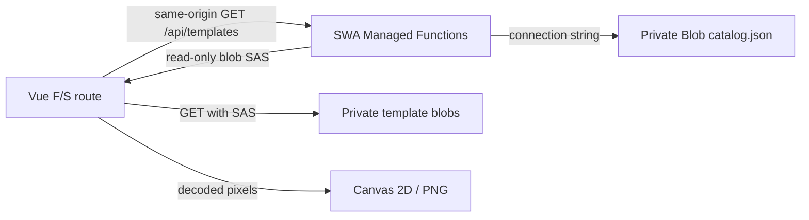

## Context

現在のF/S基盤は、Bicepで作成した一つのAzure Static Web Apps Freeへ、GitHub Actionsが生成済みVue成果物を`main`の固定環境とPRプレビュー環境へ配信している。`api/`、Storage Account、Blobカタログ、Application Settings、リリース識別はまだ存在せず、SWA CLIも静的成果物だけを起動している。

初期リリースでは、非公開BlobのカタログをSWAマネージドAPIが読み、公開中のテンプレートにだけ短期間・読み取り専用SASを付け、ブラウザがBlobから画像を直接取得する方針が決まっている。利用者は既存のSWA Freeアプリでも同じService SAS構成を運用しており、フロントとAPIの`package.json` version不一致を制作開始前に検出する方式も実績がある。

一方、SWAのマネージドFunctionsはManaged Identityを利用できない。SWA FreeとPRプレビューを維持するため、このF/SではStorage Accountの接続文字列をApplication Settingsへ保存し、アカウントキーでBlob単位のService SASを署名する。User Delegation SASを使う独立FunctionsはStandardプランと別デプロイを必要とし、PRプレビューの統合backendにも使用できないため対象外とする。

既存アプリでは、完成時に遅延読み込みした`html2canvas`がDOMと旧CSSを参照し、再デプロイで旧ハッシュ付きCSSが消えた後のキャプチャが壊れたことがある。Moment PaletteはCanvasへ直接描画してPNG Blobを生成するため、CSSのハッシュを外すのではなく、制作開始後に未取得のJavaScript、CSS、テンプレートを要求しないことを実際の再デプロイで確認する。

このchangeは製品機能を確定する本実装ではなく技術F/Sである。iPhone 15（iOS 26）のSafari・Chromeを合否対象とし、Android Chromeは端末を確保できるリリース後のフォロー項目とする。完了時はdelta specをmain specsへ同期せず、F/S専用UIを削除対象、API契約、純粋ロジック、IaC、運用判断を後続changeへの昇格候補として評価する。

## Goals / Non-Goals

**Goals:**

- SWA CLIでVue成果物とNode.js 22のマネージドFunctionsを同一オリジンの`/api`として起動する。
- SWA Freeの固定環境とPRプレビューへ、フロントとマネージドAPIを一回のworkflowから配信する。
- private container上のカタログを検証し、サーバー時刻で公開対象を絞り、Blob単位・読み取り専用・60分のService SASを発行する。
- 秘密情報をApplication Settingsまたは追跡対象外のローカル設定に限定し、クライアント成果物とログへ露出させない。
- iPhone Safari・ChromeがSAS画像をCORS経由で取得し、Canvasを汚染せずPNGへ出力できることを確認する。
- フロント、API、`release.json`のapp versionとbuild IDをStart時に照合し、混在時は制作状態を作る前にリロードを案内する。
- 選択したテンプレートと制作完遂に必要なコードをStart前に取得し、同一PR環境への再デプロイ後も旧タブで完成、保存、共有まで継続する。
- カタログ、API、静的shell、release情報、テンプレートアセットのキャッシュと削除猶予について、本実装へ引き継げる判断材料を残す。

**Non-Goals:**

- 製品用のテンプレート選択画面、制作フロー、デザインを完成させること。
- Cosmos DB、管理画面、管理者認証、テンプレートアップロードAPIを追加すること。
- User Delegation SAS、Managed Identity、Key Vault、SWA Standard、独立Functionsを採用すること。
- ユーザーの写真、作品、制作途中状態、完成PNGをAzureへ送信または保存すること。
- ページを閉じた後やブラウザによるページ破棄後の制作再開を保証すること。
- Android Chromeを今回の合否条件へ含めること。
- `html2canvas`を導入すること、または静的CSS・JavaScript全体からcontent hashを外すこと。

## Decisions

### 1. SWAマネージドAPIをService SAS発行者にする

配信経路は次の構成とする。

APIはカタログ取得、形式検証、公開判定、SAS発行だけを担当する。画像bytesをAPI経由でproxyする案は同一オリジンになりCORSを避けられるが、Functionsの帯域と実行時間を画像配信へ使い、Blobの直接配信を活かせないため採用しない。

Managed IdentityによるUser Delegation SASは資格情報の扱いが優れるが、SWAマネージドFunctionsでは利用できない。SWA FreeとPRプレビューを保つため、`AZURE_STORAGE_CONNECTION_STRING`をApplication Settingsに置き、`@azure/storage-blob`からService SASを生成する。SASはカタログに列挙された個別Blobだけを対象とし、権限はreadだけ、有効期間はF/S仮説として60分、HTTPSのみとする。時刻ずれによる開始直後の拒否を避けるため`startsOn`は指定しない。

### 2. private Storageを既存F/S IaCへ追加する

既存BicepへStorageV2のStandard_LRS、Blob Service、private containerを追加する。Storage Accountでは匿名Blobアクセスを明示的に無効化し、TLS 1.2以上、public network経由のHTTPSを使用する。SWAマネージドFunctionsがアカウントキーを使うため、このF/SではShared Keyを許可する。

Blob Serviceでは、動的なPRプレビューhostnameからもSAS画像を取得できるよう、CORS originを`*`、methodを`GET`、`HEAD`、`OPTIONS`に限定する。CORSはアクセス制御ではなく、SASを持たないprivate Blobへの要求は引き続き拒否される。本番でoriginを固定できるかはF/S結果から再評価する。

誤削除とカタログ上書きから復旧できるよう、blob soft deleteとversioningを有効化する。テンプレート画像は`templates/<template-id>/<revision>/...`の変更しないパスへ置き、カタログだけを最後に更新する。F/S用fixtureには既存の文鳥01アセットを使用し、サムネイル、線画、4マスクを一つのrevisionとしてアップロードする。

Bicepは秘密値を受け取らず、接続文字列をoutputしない。IaC適用後、認証済み開発者がAzure CLIで接続文字列を取得してSWA Application Settingsへ設定する。ローカルではgitignore対象の`api/local.settings.json`だけを使用する。

### 3. APIはNode.js 22・Functions v4の独立packageにする

`api/`はフロントのNode.js 24 packageから分け、`staticwebapp.config.json`の`apiRuntime`を`node:22`とする。APIはAzure Functions v4プログラミングモデル、TypeScript、`@azure/functions`、`@azure/storage-blob`を使用する。

SWAのOryx API buildはnpmまたはYarnを前提とするため、フロントは既存のpnpmを維持し、`api/`は公式例と同様に独立した`package-lock.json`を持つnpm packageとする。二つのpackage managerが存在する範囲を明示し、rootの品質検査からAPIのinstall、typecheck、test、buildも実行する。

ローカル統合確認では、一つのNode.js processへ無理に両runtimeを載せない。Node.js 24でフロントをbuildしてSWA CLIを起動し、別terminalのNode.js 22でAzure Functions Core Toolsから`api/`を起動する。SWA CLIは`--api-devserver-url http://localhost:7071`でFunctions hostへproxyし、browserからは一つのlocalhost originとして見せる。`--api-location api`によるSWA CLIの自動起動は簡易確認には使えるが、runtime分離を保証できないため合否判定には使用しない。

GitHub Actionsはフロントを既存どおり事前buildして`skip_app_build: true`で渡し、`api_location: api`のAPI sourceはSWA Actionにbuildさせる。Actionは2026-09-21に公式`v1`ブランチ先端として確認した`4d27395796ac319302594769cfe812bd207490b1`を完全長SHAで参照し、実装時にも公式参照を再確認する。

### 4. カタログは形式と公開条件をAPIで検証する

カタログは少なくともschema version、catalog revision、template id、asset revision、日本語・英語名、published、公開開始・終了、thumbnail、line art、area masksのBlob pathを持つ。SASや絶対URLは保存しない。

APIはカタログ全体を構文・schema・重複id・安全な相対Blob pathについて検証する。`published`がtrueで、開始日時が未指定またはサーバー時刻以前、終了日時が未指定またはサーバー時刻より後のtemplateだけを返す。非公開、公開前、公開終了済みの情報やBlob pathはレスポンスへ含めない。不正なカタログを部分的に配信せず、診断可能なエラーとして返す。

`GET /api/templates`は`Cache-Control: no-store`とし、次を返す。

- `apiVersion`: `api/package.json`からbuild時に取り込んだversion
- `buildId`: workflowがフロントとAPIへ同時生成した一意なbuild ID
- `serverTime`: 公開判定に使用したUTC時刻
- `catalogRevision`
- `sasExpiresAt`
- 公開中templateの表示情報と各assetのBlob単位SAS URL

秘密値、アカウントキー、接続文字列、署名前の内部設定をresponseまたはlogへ出さない。SAS URL自体も通常logへ出さない。

### 5. app versionとbuild IDを別の目的で照合する

人が管理する`appVersion`と、デプロイを一意に識別する`buildId`を併用する。

- フロントの`appVersion`: root `package.json`のversion
- APIの`apiVersion`: `api/package.json`のversion
- `buildId`: GitHub Actionsではcommit SHA、ローカルでは明示した開発用ID
- `release.json`: `appVersion`、`buildId`
- API response: `apiVersion`、同じ`buildId`
- フロントbundle: `appVersion`、同じ`buildId`

品質検査は二つのpackage versionが一致しない場合に失敗する。build metadata生成処理は同じ入力からフロントbundle、`release.json`、API用generated moduleを作り、手作業で三箇所を書き換えない。

Start操作では`release.json`を`cache: 'no-store'`で再取得し、`GET /api/templates`の結果とフロント自身を比較する。三者のversionまたはbuild IDが一致しない場合は制作状態を作らず、ユーザー操作によるリロードを案内する。初回取得失敗は更新扱いにせず、再試行可能な通信エラーとして区別する。

制作開始後はrelease確認を繰り返さず、更新検出による自動リロードも行わない。API・フロントの混在を防ぐ確認と、制作中の継続性を両立させる。

### 6. Startを制作セッションの資源境界にする

F/S routeはtemplate一覧を取得して選択した後、Start処理で次を完了してから制作中状態へ遷移する。

1. release、API、フロントのversion/build整合を確認する。
2. 選択templateのサムネイル以外の線画・全マスクをSAS URLからfetchする。
3. responseをBlobまたはArrayBufferとして保持し、ImageBitmapなどCanvas描画可能な資源へdecodeする。
4. 制作完遂、PNG生成、保存、共有に必要なJavaScript moduleが読み込み済みであることを保証する。
5. session snapshotへapp version、build ID、catalog revision、template revision、読込時刻を固定する。

Start後はカタログ、SAS URL、テンプレートBlob、`release.json`を再取得しない。SASが期限切れになっても、読み込み済みbytesからPNGを完成できることを狙う。ページreloadやiOSによるページ破棄は制作状態そのものを失うため対象外とする。

CSSやJavaScriptのcontent hashはキャッシュ整合性に有効なので維持する。`html2canvas`、DOM screenshot、完成時のdynamic importを使用せず、Canvas generatorと共有処理をStart前に読み込む。既存F/S routeの遅延読み込みはrouteへ入る前だけに留め、制作開始後に必要なchunkを残さない。

### 7. キャッシュは更新確認と不変assetを分ける

配信対象ごとに次を仮説とする。

| 対象 | 方針 | 理由 |
| --- | --- | --- |
| `index.html` | `no-cache`または再検証必須 | 新しいentrypointを取得する |
| `release.json` | `no-store` | Start時に現在のbuildを確認する |
| `/api/templates` | `no-store` | 期限付きSASと公開期間を再利用しない |
| hash付きJS/CSS | 長期・immutable | build間で名前が変わる |
| revision付きtemplate Blob | 長期・immutable | 内容を上書きしない |
| catalog Blob | server側で毎回再検証 | 更新反映をF/Sで観測する |

SAS queryが変わると同じBlobでも別cache keyになる可能性があるため、一覧再取得によるcache効率はこのF/Sの診断対象とする。ただし、一つの制作セッションではStart時の一回だけ取得し、同じURLまたは取得済みbytesを再利用する。

### 8. 同じPRプレビューURLをBuild AからBuild Bへ更新する

PR番号に対応するプレビューURLは同じPRの追加pushで更新されるため、固定dev環境を追加しない。検証は次の順序で行う。

1. Build AをPRへデプロイし、iPhoneでF/S routeを開く。
2. templateを選んでStartし、少なくとも一部の制作状態を作る。
3. 同じPRへ見分けられるBuild Bをpushし、同じURLの更新完了を確認する。
4. Build Aを保持する旧タブで操作を続け、Canvas PNG生成、長押し保存、Web Shareまで完了する。
5. Start以降の計測で旧hash付きJS/CSS、release、API、Blob assetへの追加requestがないことを確認する。
6. 新しいタブで同じURLを開き、Build Bのbuild IDが表示されることを確認する。

Resource TimingとF/S自身のfetch計測をStart前後でsnapshotし、URL、種別、件数、時刻だけを診断表示する。SAS queryと秘密値は画面・文書・consoleへ記録せず、Blob URLはqueryを除去して表示する。

### 9. F/S専用コードと昇格候補を分ける

専用route、Build A/B表示、diagnostic table、公開条件fixture、手動テストUIは削除対象とする。カタログschemaと検証、公開判定、SAS発行、version/build metadata、template取得port、資源所有権、IaC、workflow、キャッシュ設定は本実装への昇格候補とする。

APIロジックは時刻、環境変数、Blob client、SAS signerを注入できる純粋な境界へ分け、公開期間、path検証、最小権限、秘密値非露出を単体テストする。フロントもversion照合、Start状態遷移、重複取得防止、resource disposeを単体テストする。

## Risks / Trade-offs

- [Storage Accountの接続文字列はSAS発行より広い権限を持つ] → Application Settingsだけに保存し、ログとクライアントへ露出させず、漏洩時は二つのStorage keyを順番にローテーションする手順を記録する。
- [SWA FreeのマネージドFunctionsではUser Delegation SASを使えない] → このF/SではBlob単位・read-only・60分のService SASへ権限と時間を限定し、将来要件が変わった場合だけStandardと独立Functionsを再評価する。
- [CORS origin `*`はSASを入手した任意originからのbrowser fetchを許す] → methodをread系に限定し、private containerと短期間SASを認可境界にする。本番でpreview originが不要なら固定originへ絞る。
- [SASが漏洩すると期限までBlobを読める] → 個別Blob、read-only、HTTPS、短期expiryとし、SAS URLをlogや診断へ残さない。
- [60分では長い中断を含む制作時間を覆えない] → Start時に必要なbytesをすべて保持し、expiry後も完成できることを検証する。再取得が必要と判明した場合はexpiry延長または安全な更新方式を再設計する。
- [SAS queryの違いでbrowser cacheが再利用されない] → revision付きpathとセッション内一回取得を優先し、再訪時の通信量を計測して本実装のcache戦略を判断する。
- [SWAのフロントとAPIの切替が完全に同時でない可能性がある] → package versionとbuild IDをStart時に三者照合し、不一致時は状態を作らずリロードを案内する。
- [ユーザーがversion更新を忘れる] → rootとAPIのversion一致をCIで強制する。build IDはcommitごとに変わるため、同じversionの再デプロイも識別する。
- [遅延chunkまたはCSSがStart後に初めて必要になる] → Start前preloadとrequest計測を実装し、Build B配信後のPNG生成・共有で旧asset requestがゼロであることを合格条件にする。
- [iOSがbackground中のpageを破棄する] → ページ破棄後の復元は初期リリース対象外として区別し、開いたpageが維持された状態でのみ継続性を判定する。
- [rootはpnpm、APIはnpmとなりlockfile運用が二系統になる] → Oryx公式経路のためAPI packageだけに限定し、両方をCIの凍結install対象にする。
- [公式SWA資料のruntime一覧に更新時差がある] → 実装時に`staticwebapp.config.json`の現行runtime表、Functions v4、Action定義を一次情報で再確認し、実Azureへのdeploy結果を最終判定にする。
- [Android固有のCORS、Canvas、memory差を検出できない] → 今回の合否から外し、同じchecklistをリリース後のフォロー項目として残す。

## Migration Plan

1. F/S結果文書とcatalog fixtureを用意し、APIとフロントの純粋ロジック、version/build metadata、単体テストを追加する。
2. BicepへStorage、private container、CORS、soft delete、versioningを追加し、what-if後に既存F/Sリソースグループへ適用する。
3. 既存文鳥01fixtureをrevision付きpathへアップロードし、catalogを最後に配置する。接続文字列をローカル設定とSWA Application Settingsへ手動設定する。
4. Node.js 22でFunctions hostを、Node.js 24でSWA CLIを別processとして起動し、SWA CLIのproxyにより同一originへ統合して、公開判定、SAS、CORS、Canvas、cache、version不一致を確認する。
5. GitHub Actionsを現行公式Actionの完全長SHAと`api_location`へ更新し、PRプレビューへBuild Aを配信する。
6. iPhone Safari・ChromeでStartしたままBuild Bを同じPRへ配信し、旧タブの完遂、新タブの更新、追加requestの有無を確認する。
7. 結果、採否、秘密値設定、key rotation、asset更新・削除手順、コードの昇格判断を文書化し、`--skip-specs`でarchiveする。

workflow、API、フロントの変更に問題がある場合はchangeのcommitをrevertし、既存の静的フロントだけのworkflowへ戻す。Storageはデータを保護するため自動削除せず、F/S完了後の扱いを結果文書で明示する。秘密値漏洩時はSWA Application Settingsを更新してStorage keyをローテーションし、発行済みSASは有効期限までの影響範囲を確認する。

## Open Questions

- 60分のSASとStart時の全asset取得で、通常制作とbackground復帰を含む実機操作を十分に完遂できるか。
- PRプレビューを本番開発でもBlob接続の確認に使用する場合、CORS origin `*`を維持するか、別の許可方法へ変えるか。
- template assetの削除猶予とsoft delete保持期間を、本番の最長制作時間に対して何日にするか。
- SAS queryが変わる再訪時に、iPhone browserが同一revision Blobをどの程度再取得するか。
- F/Sで昇格可能と判断したAPI・IaC・資源所有権を、ステップ6の本番Azure changeでそのまま使うか、設計だけを引き継いで再実装するか。
